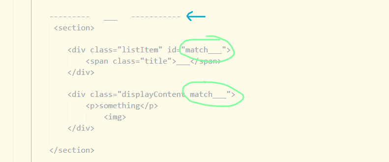
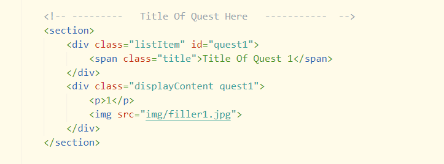

# Quests Code Explained
## HTML
see the ID and Class named 'match___' in pic below.
These can be named anything, but must match eachother for JS to work. The JS takes the ID and adds a '.' at the beginning to find the class with the same name and displays that content. These could be named the same as title, without spaces; or anything else, as long as each section's div has a unique ID name and each ID name matches its corresponding class name (next to displayContent) 

In this next example of a similar section, they are both named quest1         ✅

### listItem ###
.listItem is the class name given to all items on left that get colored on hover/ click (named Title of Quest 1 - 5 currently )

### displayContent ###
.displayContent is the content that shows up on the screen when you click the <strong>.lisItem</strong>

### displayOnPageLoad ###
.displayOnPageLoad (not in pic) is an optional section that appears on page load. To make one of the <strong>.displayContents</strong> appear instead, add the class <strong>.stick</strong> next to the <strong>.displayContent</strong> class of the content you want to appear

When using the commented out template (pic 1) to add new content:
1) After pasting the template where you want it, comment out that line next to the blue arrow (pic 1) and add title (see title commented out 2nd pic)
This commented out title helps keep each section separated nicely once there is lots of content in each section

2) Make sure the last item to the bottom of kyu section has a class of <strong>.last</strong> (see CSS below)

## CSS ##

* There is a spacer line between each list item made with border-bottom in css. The last list item at the bottom of the section needs this line removed to look good. :last-child wasn't working for some reason, so .listItem.last is used to remove that line. Unless someone can figure that out, 

* Anything with kyu in the name will probably be renamed

* if anyone want's to fix layout, note that the <strong>.displayContent</strong> div and <strong>.displayOnPageLoad</strong> must have equal position and dimension values so that they line up. Also <strong>.kyuVerticalContainer</strong> is the container on left that has all kyu sections. The flex-basis and margin on this can be edited along with the .displayContent width to change the overall layout dimensions

## JS ##

### stick ###
When a <strong>.listItem</strong> is clicked, JS adds a class of <strong>.stick</strong> to the div below it, next to the class of <strong>.displayContent</strong>. By default <strong>.displayContent</strong> has a declaration of display: none; <strong>.stick</strong> has a declaration of display: block; which makes the content appear

I just realized that displayContent is not the best name for that class because it doesn't actually display the content lol. But, it does hold all of the style and layout for the displayed content
